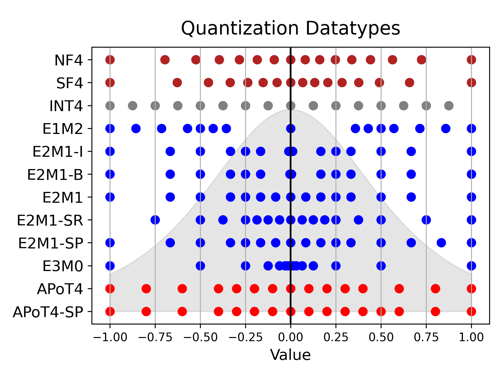

# [Learning from Students: Applying t-Distributions to Explore Accurate and Efficient Formats for LLMs](https://arxiv.org/abs/2405.03103)
By [Jordan Dotzel](https://jordandotzel.com), [Yuzong Chen](https://yc2367.github.io/), Bahaa Kotb, Sushma Prasad, Gang Wu, Sheng Li, [Mohamed S. Abdelfattah](https://www.mohsaied.com/), [Zhiru Zhang](https://www.csl.cornell.edu/~zhiruz/index.html)


<div style="text-align: center;">
    
</div>

## Introduction

This is the corresponding code the for the ICML paper  *Learning from Students: Applying t-Distributions to Explore Accurate and Efficient Formats for LLMs*. This work first conducts a large-scale analysis of LLM weights and activations across 30 networks and concludes that most distributions follow a Student’s t-distribution. It then derives a new theoretically optimal format, Student Float (SF4), that improves over NF4 across modern LLMs. Then, using this format as a high-accuracy reference, it proposes augmenting E2M1 with two variants of supernormal support for higher model accuracy. Finally, it explores the quality and efficiency frontier across 11 datatypes by evaluating their model accuracy and hardware complexity. It discovers a Pareto curve composed of INT4, E2M1, and E2M1 with supernormal support, which offers a continuous tradeoff between model accuracy and chip area.


## Getting Started

To get started, create a conda environment with the required dependencies and activate it.

```bash
conda env create -f requirements.yaml
conda activate llm-datatypes
```

Then, use `run_quant.py` to run the quantization and evaluation on desired tasks. For example:

```bash
python run_quant.py --model facebook/opt-125m  --quantize --batch_size=64 --tasks lambada_openai --bits=4 --dtype=sf4_5 --group_size=128 --algo=RTN
```

With access to a slurm server, run the `run_quant_slurm.sh` script for batched evaluation:
```bash
slurm batch run_quant_slurm.sh
```


## Evaluation

Use `run_quant.py` to quantize and evaluate the model across common datasets. It includes support for weight and activation quantization, including with GPTQ[1] and SmoothQuant[2]. In addition, it has arguments that can specify the models, the evaluation tasks, and quantization settings. Below are the most important arguments, but all can be found in the argparse section in `run_quant.py`.

### Important Arguments

- `quantize`: Enables model quantization.
- `model`: Specifies the model to use (default: `EleutherAI/gpt-j-6b`).
- `device`: Defines the device to use (default: `cuda:0`).
- `seed`: Seed for sampling calibration data (default: `42`).
- `tasks`: List of tasks for accuracy validation (default: `["lambada_openai", "hellaswag", "winogrande", "piqa", "wikitext"]`).

#### SmoothQuant
SmoothQuant can be used to increase the accuracy of models with weight and activation quantization. The `alpha` argument allows balancing the quantization error on the weights and activations.

- `sq`: Enables SmoothQuant.
- `alpha`: SmoothQuant parameter (default: `0.5`).

#### Quantization

- `enable_activation`: Enables activation quantization.
- `activation_quantile`: Clipping quantile for dynamic activation quantization (default: `1.0`).
- `algo`: Specifies the weight-only quantization algorithm (default: `RTN`, choices: `RTN`, `AWQ`, `TEQ`, `GPTQ`).
- `bits`: Number of bits for quantization (default: `8`).
- `group_size`: Group size for quantization (default: `-1`).
- `dtype`: Data type for quantization (default: `int`).

#### Datatypes
Use the `dtype` argument to select datatypes. Below the most important datatypes are listed, the full list is provided in `neural-compressor/adapter/torch_utils/weight_only.py`. In the code, they are implemented as lists of floating-point values so additional datatypes can be easily experimented with.

- **NF4**: Normal Float (NF4) defined in QLoRA [3]

- **SF4_5**: Our proposed Student Float (SF4) format derived from the Student's t-distribution.

- **FP4_BASIC**:
  The standard E2M1 format with subnormal support

- **FP4_RANGE**:
  Our super-range E2M1 variant that provides higher accuracy especially on distributions with large spread.

- **FP4_PREC2**:
  Our super-precision E2M1 variant that leads to high accuracy across most distributions over E2M1.

- **FP4_LOG**:
  A symmetric 4-bit logarithmic format.

- **APOT4**:
  A 4-bit Additive-Powers-of-Two format.

- **APOT4_SP**:
  A 4-bit Additive-Powers-of-Two format with super-precision.

## Acknowledgements

This code was built from the Intel Neural Compressor [codebase](https://github.com/intel/neural-compressor).

## References

1. Frantar, E., Ashkboos, S., Hoefler, T., & Alistarh, D. GPTQ: Accurate Post-Training Quantization for Generative Pre-trained Transformers. \*ICLR 2023\*. [https://arxiv.org/abs/2210.17323](https://arxiv.org/abs/2210.17323)

2. Xiao, G., Lin, J., Seznec, M., Wu, H., Demouth, J., & Han, S. SmoothQuant: Accurate and Efficient Post-Training Quantization for Large Language Models. \*ICML 2024\*. [https://arxiv.org/abs/2211.10438](https://arxiv.org/abs/2211.10438)

3. Dettmers, T., Pagnoni, A., Holtzman, A., & Zettlemoyer, L. QLoRA: Efficient Finetuning of Quantized LLMs. \*NeurIPS 2023\*. [https://arxiv.org/abs/2305.14314](https://arxiv.org/abs/2305.14314)


## Citation
```
@article{dotzel2024students,
      title={Learning from Students: Applying t-Distributions to Explore Accurate and Efficient Formats for LLMs}, 
      author={Jordan Dotzel and Yuzong Chen and Bahaa Kotb and Sushma Prasad and Gang Wu and Sheng Li and Mohamed S. Abdelfattah and Zhiru Zhang},
      year={2024},
      journal={International Conference on Machine Learning}
}
```